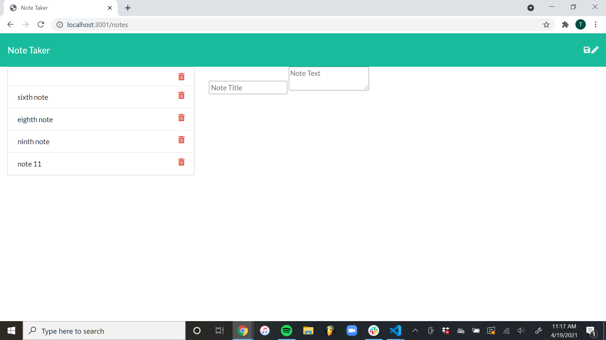

# NoteTaker

Note Taker Homework Week 11

# Description

This application is designed to allow the user to add and delete notes that they write.
When the user clicks on "Get Started", the user will be taken to the Notes page where the user
can give the name of the new note and the description of the new note.
When the user clicks the "save" icon, the note's name and description will be added to the list of 
saved notes on the left side of the page.
When the user clicks on the "trashcan" icon next to the saved notes on the left side of the page,
the note will be deleted from the list of notes.

# Table of Contents

* [installation](#installation)
* [usage](#usage)
* [contributing](#contributing)
* [github](#github)
* [license](#license)
* [screenshot](#screenshot)

# Installation

The user will need to run "node server.js" in the terminal and view the application on local port 3001.

# Usage

This applicaiton allows the user to create, save and delete notes using Express.

# Contributing

The application contributes to the knowledge of Express as a developer and contributes to a useful app
for the user.

# GitHub

{https://github.com/tkuebler12/NoteTaker}

# License

MIT

# Screenshot

